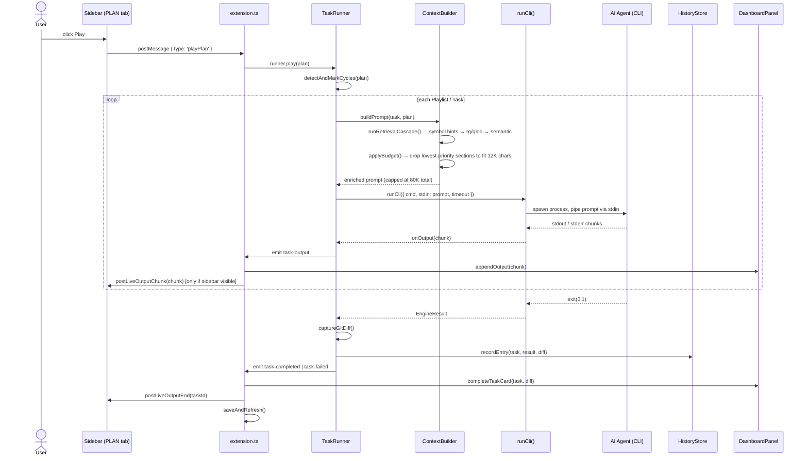
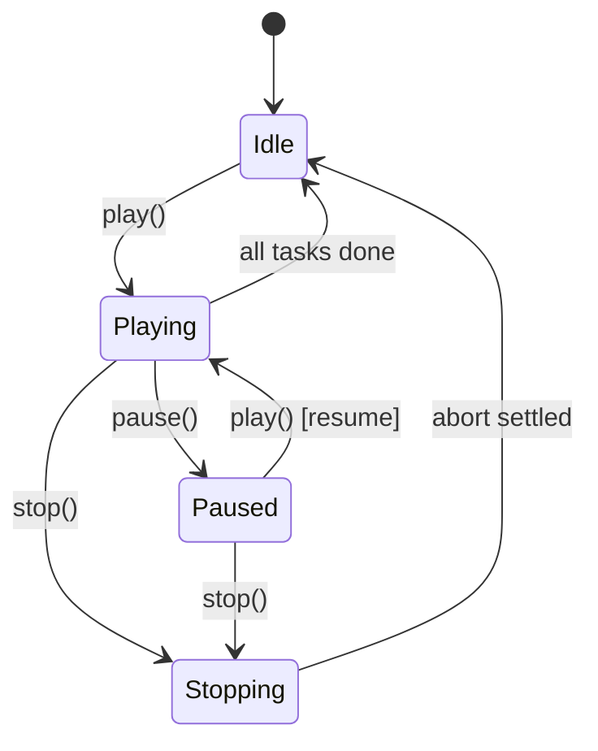
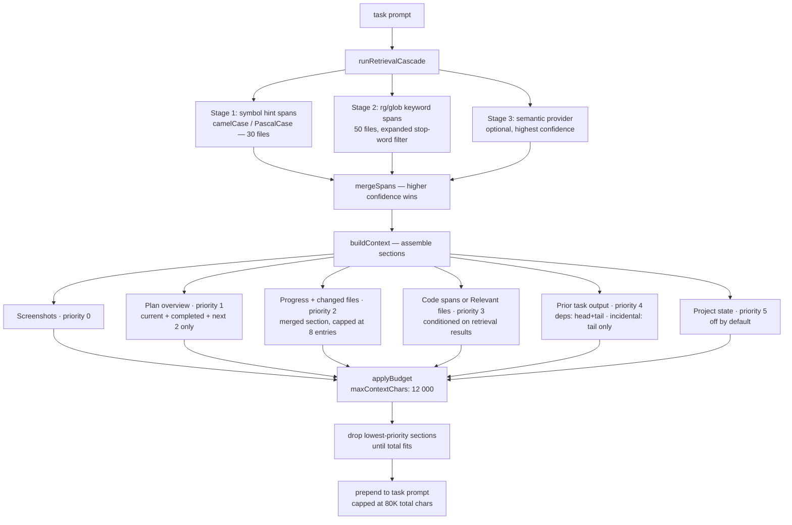
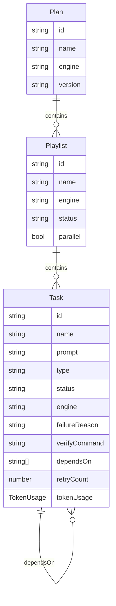
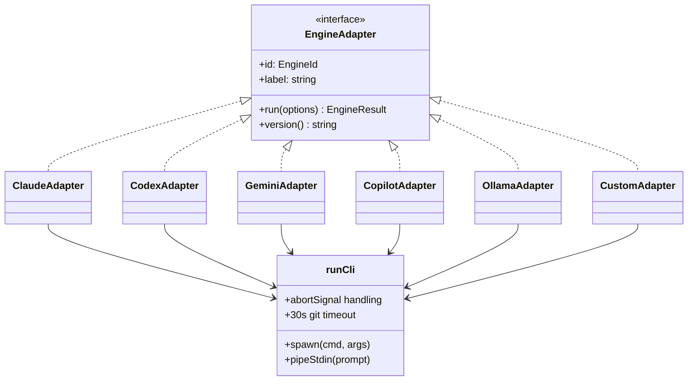
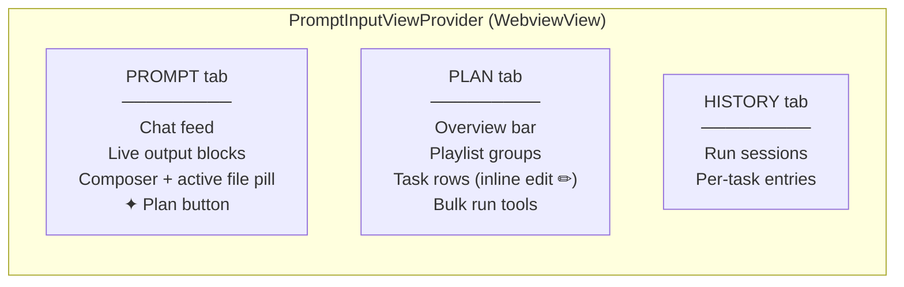

# MOAG — Architecture Overview

> Agent Task Player (extension ID: `moag.agent-task-player`)  
> Orchestrates AI coding agents (Claude Code, Codex, Gemini CLI, Copilot, Ollama) to run task playlists inside VS Code.

---

## High-Level Component Map

```mermaid
graph TD
    subgraph VSCode["VS Code Host"]
        EXT["extension.ts\n(activation / wiring)"]
    end

    subgraph UI["UI Layer"]
        SIDEBAR["PromptInputViewProvider\n(sidebar webview)\nTabs: PROMPT · PLAN · HISTORY"]
        DASHBOARD["DashboardPanel\n(webview panel)\nLive output · Completed cards · Diffs"]
        PLANTREE["PlanTreeProvider\n(tree view)"]
        TASKEDITOR["TaskEditorPanel\n(webview panel)"]
        HISTTREE["HistoryTreeProvider\n(tree view)"]
        SESTREE["SessionsTreeProvider\n(tree view)"]
    end

    subgraph Core["Core"]
        RUNNER["TaskRunner\n(state machine)\nIdle → Playing → Paused → Stopping"]
        CTX["ContextBuilder\n(prompt enrichment + token budget)"]
        HISTORY["HistoryStore\n(per-task run log)"]
        PLAN["plan.ts\n(load · save · hydrate · dehydrate)"]
    end

    subgraph Adapters["Engine Adapters"]
        BASE["runCli()\n(stdin pipe, abort, timeout)"]
        CLAUDE["ClaudeAdapter"]
        CODEX["CodexAdapter"]
        GEMINI["GeminiAdapter"]
        COPILOT["CopilotAdapter"]
        OLLAMA["OllamaAdapter"]
        CUSTOM["CustomAdapter"]
    end

    subgraph Sandbox["Sandbox"]
        SBMGR["SandboxManager\n(Docker / local)"]
        DETECT["ProjectDetector\n(framework probe)"]
        SHOT["Screenshot\n(puppeteer)"]
    end

    subgraph Models["Models / Types"]
        TYPES["types.ts\nPlan · Playlist · Task\nTaskStatus · RunnerState\nEngineResult · HistoryEntry"]
    end

    EXT -->|"creates & wires"| SIDEBAR
    EXT -->|"creates & wires"| DASHBOARD
    EXT -->|"creates & wires"| PLANTREE
    EXT -->|"creates & wires"| TASKEDITOR
    EXT -->|"creates & wires"| HISTTREE
    EXT -->|"creates & wires"| SESTREE
    EXT -->|"owns"| RUNNER
    EXT -->|"owns"| HISTORY
    EXT -->|"reads/writes"| PLAN

    RUNNER -->|"task-started\ntask-output\ntask-completed\ntask-failed"| EXT
    EXT -->|"forwards events"| DASHBOARD
    EXT -->|"forwards events"| SIDEBAR
    EXT -->|"forwards events"| PLANTREE

    RUNNER -->|"buildPrompt()"| CTX
    RUNNER -->|"executeTask()"| BASE
    BASE --> CLAUDE
    BASE --> CODEX
    BASE --> GEMINI
    BASE --> COPILOT
    BASE --> OLLAMA
    BASE --> CUSTOM

    RUNNER -->|"records result"| HISTORY
    RUNNER -->|"reads plan"| TYPES

    SIDEBAR -->|"postMessage: submit\nplayPlan · playTask\nsaveTaskEdit · generatePlan"| EXT
    DASHBOARD -->|"postMessage: retry\nstop · openTask"| EXT

    EXT -->|"sandbox commands"| SBMGR
    SBMGR --> DETECT
    SBMGR --> SHOT
```

---

## Data Flow — Task Execution

---

## State Machine — TaskRunner

---

## Context Builder — Token Budget Pipeline

---

## Plan File Structure

---

## Engine Adapter Hierarchy

---

## UI Layer — Sidebar Tabs

---

## Key Conventions

| Convention | Detail |
|---|---|
| Prompt delivery | All adapters pipe via **stdin** (not CLI args) — avoids Windows 8K cmd limit |
| Prompt size cap | Trimmed to **80K chars** — task part preserved, prefix truncated |
| Task timeout | Configurable via `agentTaskPlayer.taskTimeoutMs` (default 10 min) |
| Git timeout | 30s hard kill on all `git` subprocesses |
| Play lock | `_playLock` mutex prevents concurrent `play()` calls |
| Status persistence | `dehydrateTask` saves non-pending status to plan JSON after each task |
| Dashboard safety | `safePostMessage()` guards against disposed panel crashes |
| Live output | Buffered at 120ms, **skipped entirely when sidebar is not visible** |
| Cycle detection | DFS (white/gray/black) marks cyclic `dependsOn` tasks as Blocked before execution |
| Failure classification | `classifyFailure()` → drives retry delay (rate-limit: 30s, auth: no retry) |

---

## Token Efficiency — What Gets Sent Per Task

| Section | Size control | Key optimisation |
|---|---|---|
| **Plan overview** | Scales with plan size | Only current + completed + next 2 shown; all other future tasks omitted with count |
| **Progress + files** | Capped at 8 entries | Merged into one section (was two); file list capped at 4 per task |
| **Code spans** | `maxFileContextChars` (6K) | Retrieval cascade: symbol hints → rg/glob → semantic; spans replace whole-file dumps |
| **Config files** | Conditional | `package.json` / `tsconfig.json` only on first task or when prompt mentions build keywords |
| **Prior output** | `maxOutputPerTask` (1.5K) | Explicit `dependsOn` deps: head+tail; incidental tasks: tail only |
| **Stop words** | ~80 blocked terms | Generic verbs/nouns (`create`, `file`, `function`, `class`…) excluded from keyword extraction |
| **Total budget** | `maxContextChars` (12K) | `applyBudget()` drops lowest-priority sections; never truncates high-priority ones |
